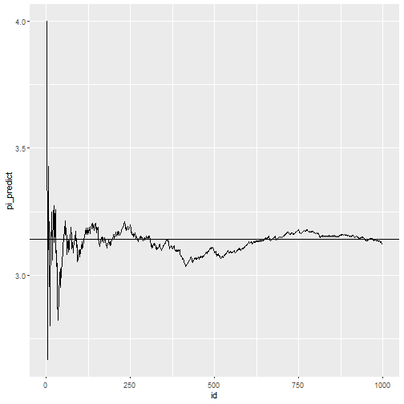
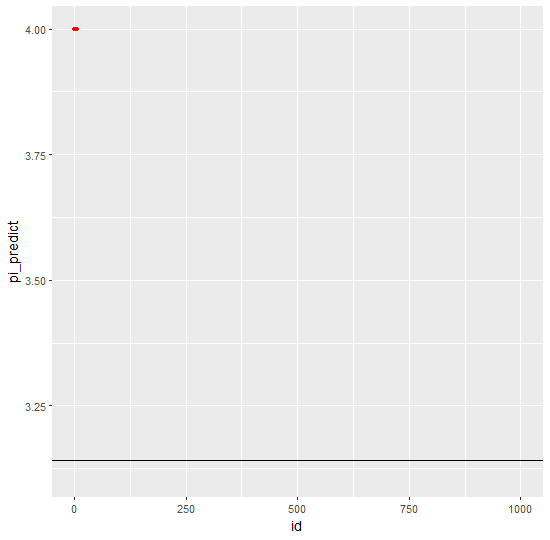

# π值的计算

构造一个单位正方形和一个单位圆的1/4，往整个区域内随机投入点，根据点到原点的距离>1还是<=1判断点是落在1/4的圆内还是在圆外，从而根据落在两个不同区域的点的数目，求出两个区域的比值。这个比值乘以4，即是圆周率π。


```r
library(tidyverse)
pi_data <- function(n){
  x0 <- 0
  y0 <- 0
  x <- runif(n)
  y <- runif(n)
  distances <- sqrt((x-x0)^2+(y-y0)^2)
  point <- ifelse(distances <= 1, "inside", "outside")
  id <- 1:n
  pi_predict <- cumsum(point == "inside")/id * 4
  data <- data.frame(id, x, y, distances, point, pi_predict)
}
data1000 <- pi_data(n = 1000)
```


```r
p1 <- ggplot(data1000) + 
  geom_rect(aes(xmin = 0,xmax = 1,ymin = 0, ymax = 1),color = "black",alpha = 0) +
  ggforce::geom_arc(aes(x0 = 0, y0 = 0,r = 1,
    start = 0,end = pi/2)) +coord_fixed() +
  geom_point(data = data1000,aes(x,y,color = point))
p1
```


```r
p2 <- ggplot(data1000) +
  geom_line(aes(x = id,y = pi_predict))+
  geom_hline(yintercept = pi)
p2
```



# 试下动态图


```r
library(gganimate)
anim <- ggplot(data1000) + 
  geom_rect(aes(xmin = 0,xmax = 1,ymin = 0, ymax = 1),color = "black",alpha = 0) +
  ggforce::geom_arc0(aes(x0 = 0, y0 = 0,r = 1,
    start = 0,end = pi/2)) +coord_fixed() +
  geom_point(data = data1000,aes(x,y,color = point,group = id)) +
  transition_reveal(along = id) +
   labs(title = "frame:{frame} of {nframes}")
anim2 <-animate(anim, nframes = 100, fps = 10,
                  width = 550, height = 540, res = 90,
                  renderer = gifski_renderer(loop = T))
```

```
## 
Rendering [>---------------------------------------------] at 7 fps ~ eta: 14s
Rendering [>-------------------------------------------] at 7.6 fps ~ eta: 13s
Rendering [=>--------------------------------------------] at 8 fps ~ eta: 12s
Rendering [=>------------------------------------------] at 8.2 fps ~ eta: 12s
Rendering [==>-----------------------------------------] at 8.3 fps ~ eta: 11s
Rendering [==>-----------------------------------------] at 8.5 fps ~ eta: 11s
Rendering [===>----------------------------------------] at 8.6 fps ~ eta: 11s
Rendering [===>----------------------------------------] at 8.7 fps ~ eta: 10s
Rendering [===>----------------------------------------] at 8.8 fps ~ eta: 10s
Rendering [====>---------------------------------------] at 8.8 fps ~ eta: 10s
Rendering [=====>--------------------------------------] at 8.5 fps ~ eta: 10s
Rendering [======>-------------------------------------] at 8.6 fps ~ eta: 10s
Rendering [=======>------------------------------------] at 8.6 fps ~ eta: 10s
Rendering [=======>------------------------------------] at 8.6 fps ~ eta:  9s
Rendering [========>-----------------------------------] at 8.6 fps ~ eta:  9s
Rendering [=========>----------------------------------] at 8.6 fps ~ eta:  9s
Rendering [==========>---------------------------------] at 8.5 fps ~ eta:  9s
Rendering [==========>---------------------------------] at 8.4 fps ~ eta:  9s
Rendering [===========>--------------------------------] at 8.4 fps ~ eta:  9s
Rendering [============>-------------------------------] at 8.5 fps ~ eta:  8s
Rendering [============>-------------------------------] at 8.4 fps ~ eta:  8s
Rendering [=============>------------------------------] at 8.4 fps ~ eta:  8s
Rendering [==============>-----------------------------] at 8.5 fps ~ eta:  8s
Rendering [==============>-----------------------------] at 8.4 fps ~ eta:  8s
Rendering [===============>----------------------------] at 8.4 fps ~ eta:  8s
Rendering [===============>----------------------------] at 8.3 fps ~ eta:  8s
Rendering [================>---------------------------] at 8.3 fps ~ eta:  7s
Rendering [=================>--------------------------] at 8.3 fps ~ eta:  7s
Rendering [==================>-------------------------] at 8.3 fps ~ eta:  7s
Rendering [===================>------------------------] at 8.3 fps ~ eta:  7s
Rendering [====================>-----------------------] at 8.3 fps ~ eta:  6s
Rendering [=====================>----------------------] at 8.2 fps ~ eta:  6s
Rendering [=====================>----------------------] at 8.1 fps ~ eta:  6s
Rendering [======================>---------------------] at 8.1 fps ~ eta:  6s
Rendering [=======================>--------------------] at 7.9 fps ~ eta:  6s
Rendering [=======================>--------------------] at 7.7 fps ~ eta:  6s
Rendering [========================>-------------------] at 7.6 fps ~ eta:  6s
Rendering [========================>-------------------] at 7.5 fps ~ eta:  6s
Rendering [=========================>------------------] at 7.3 fps ~ eta:  6s
Rendering [=========================>------------------] at 7.2 fps ~ eta:  6s
Rendering [==========================>-----------------] at 7.2 fps ~ eta:  5s
Rendering [===========================>----------------] at 7.2 fps ~ eta:  5s
Rendering [============================>---------------] at 7.2 fps ~ eta:  5s
Rendering [=============================>--------------] at 7.2 fps ~ eta:  4s
Rendering [==============================>-------------] at 7.2 fps ~ eta:  4s
Rendering [===============================>------------] at 7.2 fps ~ eta:  4s
Rendering [===============================>------------] at 7.1 fps ~ eta:  4s
Rendering [================================>-----------] at 7.1 fps ~ eta:  4s
Rendering [================================>-----------] at 7.1 fps ~ eta:  3s
Rendering [=================================>----------] at 7.1 fps ~ eta:  3s
Rendering [==================================>---------] at 7.1 fps ~ eta:  3s
Rendering [===================================>--------] at 7.1 fps ~ eta:  3s
Rendering [====================================>-------] at 7.1 fps ~ eta:  2s
Rendering [=======================================>------] at 7 fps ~ eta:  2s
Rendering [========================================>-----] at 7 fps ~ eta:  2s
Rendering [========================================>-----] at 7 fps ~ eta:  1s
Rendering [=========================================>----] at 7 fps ~ eta:  1s
Rendering [==========================================>---] at 7 fps ~ eta:  1s
Rendering [===========================================>--] at 7 fps ~ eta:  1s
Rendering [============================================>-] at 7 fps ~ eta:  0s
Rendering [===========================================>] at 6.9 fps ~ eta:  0s
Rendering [============================================] at 6.9 fps ~ eta:  0s
                                                                              
```

```
## 
Frame 1 (1%)
Frame 2 (2%)
Frame 3 (3%)
Frame 4 (4%)
Frame 5 (5%)
Frame 6 (6%)
Frame 7 (7%)
Frame 8 (8%)
Frame 9 (9%)
Frame 10 (10%)
Frame 11 (11%)
Frame 12 (12%)
Frame 13 (13%)
Frame 14 (14%)
Frame 15 (15%)
Frame 16 (16%)
Frame 17 (17%)
Frame 18 (18%)
Frame 19 (19%)
Frame 20 (20%)
Frame 21 (21%)
Frame 22 (22%)
Frame 23 (23%)
Frame 24 (24%)
Frame 25 (25%)
Frame 26 (26%)
Frame 27 (27%)
Frame 28 (28%)
Frame 29 (29%)
Frame 30 (30%)
Frame 31 (31%)
Frame 32 (32%)
Frame 33 (33%)
Frame 34 (34%)
Frame 35 (35%)
Frame 36 (36%)
Frame 37 (37%)
Frame 38 (38%)
Frame 39 (39%)
Frame 40 (40%)
Frame 41 (41%)
Frame 42 (42%)
Frame 43 (43%)
Frame 44 (44%)
Frame 45 (45%)
Frame 46 (46%)
Frame 47 (47%)
Frame 48 (48%)
Frame 49 (49%)
Frame 50 (50%)
Frame 51 (51%)
Frame 52 (52%)
Frame 53 (53%)
Frame 54 (54%)
Frame 55 (55%)
Frame 56 (56%)
Frame 57 (57%)
Frame 58 (58%)
Frame 59 (59%)
Frame 60 (60%)
Frame 61 (61%)
Frame 62 (62%)
Frame 63 (63%)
Frame 64 (64%)
Frame 65 (65%)
Frame 66 (66%)
Frame 67 (67%)
Frame 68 (68%)
Frame 69 (69%)
Frame 70 (70%)
Frame 71 (71%)
Frame 72 (72%)
Frame 73 (73%)
Frame 74 (74%)
Frame 75 (75%)
Frame 76 (76%)
Frame 77 (77%)
Frame 78 (78%)
Frame 79 (79%)
Frame 80 (80%)
Frame 81 (81%)
Frame 82 (82%)
Frame 83 (83%)
Frame 84 (84%)
Frame 85 (85%)
Frame 86 (86%)
Frame 87 (87%)
Frame 88 (88%)
Frame 89 (89%)
Frame 90 (90%)
Frame 91 (91%)
Frame 92 (92%)
Frame 93 (93%)
Frame 94 (94%)
Frame 95 (95%)
Frame 96 (96%)
Frame 97 (97%)
Frame 98 (98%)
Frame 99 (99%)
Frame 100 (100%)
## Finalizing encoding... done!
```

```r
anim2
```


```r
make_run2 <- function(pi_data){
  anim <- ggplot(pi_data,aes(id ,pi_predict)) +
    geom_line() +
    geom_point(aes(group = seq_along(id)),color = "red",size = 1)+
    transition_reveal(id)+
    geom_hline(yintercept = pi)
  anim2 <-animate(anim, nframes = 100, fps = 10,
                  width = 550, height = 540, res = 90,
                  renderer = gifski_renderer(loop = T))
}
last <- make_run2(data1000)
```

```
## 
Rendering [=>-------------------------------------------] at 16 fps ~ eta:  6s
Rendering [==>------------------------------------------] at 16 fps ~ eta:  6s
Rendering [===>-----------------------------------------] at 16 fps ~ eta:  6s
Rendering [====>----------------------------------------] at 15 fps ~ eta:  6s
Rendering [=====>---------------------------------------] at 15 fps ~ eta:  6s
Rendering [======>--------------------------------------] at 14 fps ~ eta:  6s
Rendering [=======>-------------------------------------] at 14 fps ~ eta:  6s
Rendering [========>------------------------------------] at 14 fps ~ eta:  6s
Rendering [=========>-----------------------------------] at 14 fps ~ eta:  6s
Rendering [==========>----------------------------------] at 14 fps ~ eta:  6s
Rendering [==========>----------------------------------] at 14 fps ~ eta:  5s
Rendering [===========>---------------------------------] at 14 fps ~ eta:  5s
Rendering [============>--------------------------------] at 13 fps ~ eta:  5s
Rendering [=============>-------------------------------] at 13 fps ~ eta:  5s
Rendering [==============>------------------------------] at 13 fps ~ eta:  5s
Rendering [===============>-----------------------------] at 13 fps ~ eta:  5s
Rendering [================>----------------------------] at 13 fps ~ eta:  5s
Rendering [=================>---------------------------] at 13 fps ~ eta:  5s
Rendering [==================>--------------------------] at 13 fps ~ eta:  5s
Rendering [===================>-------------------------] at 13 fps ~ eta:  4s
Rendering [====================>------------------------] at 13 fps ~ eta:  4s
Rendering [=====================>-----------------------] at 13 fps ~ eta:  4s
Rendering [=====================>-----------------------] at 12 fps ~ eta:  4s
Rendering [======================>----------------------] at 12 fps ~ eta:  4s
Rendering [=======================>---------------------] at 12 fps ~ eta:  4s
Rendering [========================>--------------------] at 12 fps ~ eta:  4s
Rendering [=========================>-------------------] at 12 fps ~ eta:  4s
Rendering [==========================>------------------] at 12 fps ~ eta:  3s
Rendering [===========================>-----------------] at 12 fps ~ eta:  3s
Rendering [============================>----------------] at 12 fps ~ eta:  3s
Rendering [=============================>---------------] at 12 fps ~ eta:  3s
Rendering [==============================>--------------] at 12 fps ~ eta:  3s
Rendering [===============================>-------------] at 12 fps ~ eta:  3s
Rendering [===============================>-------------] at 11 fps ~ eta:  2s
Rendering [================================>------------] at 11 fps ~ eta:  2s
Rendering [=================================>-----------] at 11 fps ~ eta:  2s
Rendering [==================================>----------] at 11 fps ~ eta:  2s
Rendering [===================================>---------] at 11 fps ~ eta:  2s
Rendering [====================================>--------] at 11 fps ~ eta:  2s
Rendering [=====================================>-------] at 11 fps ~ eta:  1s
Rendering [======================================>------] at 11 fps ~ eta:  1s
Rendering [=======================================>-----] at 11 fps ~ eta:  1s
Rendering [========================================>----] at 11 fps ~ eta:  1s
Rendering [=========================================>---] at 11 fps ~ eta:  1s
Rendering [==========================================>--] at 11 fps ~ eta:  0s
Rendering [==========================================>--] at 10 fps ~ eta:  0s
Rendering [===========================================>-] at 10 fps ~ eta:  0s
Rendering [============================================>] at 10 fps ~ eta:  0s
Rendering [=============================================] at 10 fps ~ eta:  0s
                                                                              
```

```
## 
Frame 1 (1%)
Frame 2 (2%)
Frame 3 (3%)
Frame 4 (4%)
Frame 5 (5%)
Frame 6 (6%)
Frame 7 (7%)
Frame 8 (8%)
Frame 9 (9%)
Frame 10 (10%)
Frame 11 (11%)
Frame 12 (12%)
Frame 13 (13%)
Frame 14 (14%)
Frame 15 (15%)
Frame 16 (16%)
Frame 17 (17%)
Frame 18 (18%)
Frame 19 (19%)
Frame 20 (20%)
Frame 21 (21%)
Frame 22 (22%)
Frame 23 (23%)
Frame 24 (24%)
Frame 25 (25%)
Frame 26 (26%)
Frame 27 (27%)
Frame 28 (28%)
Frame 29 (29%)
Frame 30 (30%)
Frame 31 (31%)
Frame 32 (32%)
Frame 33 (33%)
Frame 34 (34%)
Frame 35 (35%)
Frame 36 (36%)
Frame 37 (37%)
Frame 38 (38%)
Frame 39 (39%)
Frame 40 (40%)
Frame 41 (41%)
Frame 42 (42%)
Frame 43 (43%)
Frame 44 (44%)
Frame 45 (45%)
Frame 46 (46%)
Frame 47 (47%)
Frame 48 (48%)
Frame 49 (49%)
Frame 50 (50%)
Frame 51 (51%)
Frame 52 (52%)
Frame 53 (53%)
Frame 54 (54%)
Frame 55 (55%)
Frame 56 (56%)
Frame 57 (57%)
Frame 58 (58%)
Frame 59 (59%)
Frame 60 (60%)
Frame 61 (61%)
Frame 62 (62%)
Frame 63 (63%)
Frame 64 (64%)
Frame 65 (65%)
Frame 66 (66%)
Frame 67 (67%)
Frame 68 (68%)
Frame 69 (69%)
Frame 70 (70%)
Frame 71 (71%)
Frame 72 (72%)
Frame 73 (73%)
Frame 74 (74%)
Frame 75 (75%)
Frame 76 (76%)
Frame 77 (77%)
Frame 78 (78%)
Frame 79 (79%)
Frame 80 (80%)
Frame 81 (81%)
Frame 82 (82%)
Frame 83 (83%)
Frame 84 (84%)
Frame 85 (85%)
Frame 86 (86%)
Frame 87 (87%)
Frame 88 (88%)
Frame 89 (89%)
Frame 90 (90%)
Frame 91 (91%)
Frame 92 (92%)
Frame 93 (93%)
Frame 94 (94%)
Frame 95 (95%)
Frame 96 (96%)
Frame 97 (97%)
Frame 98 (98%)
Frame 99 (99%)
Frame 100 (100%)
## Finalizing encoding... done!
```

```r
last
```


